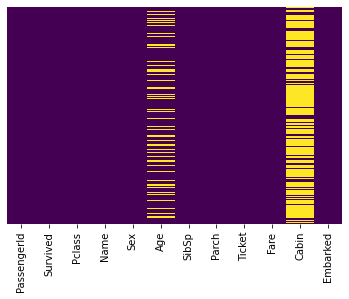
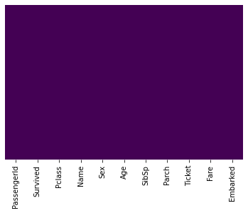

# Titanic_survival_predictor
## This is a project aimed at creating a ML model to predict the survival of passengers aboard the Titanic.
This repository only includes the data preprocessing step of creating a model. 

#### The input data:

#### The output data after preprocessing:

The yellow regions in the plots indicate missing data
